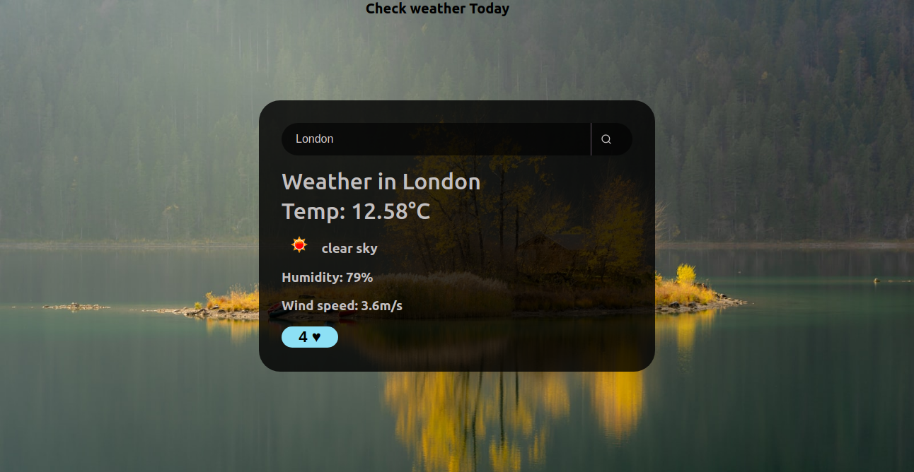

# WeatherToday 
## Author Name: Tania Osano

## View Screenshot

## Introduction
WeatherToday is a simple application that displays the current weather information comprising of temperature, humidity, wind speed and the condition of a given location that a user inputs in a search bar.

It is developed to help users get access to the information they need and be aware of the weather conditions in their location and other locations.

## Goal and Objectives
The goal of this project is to allow a user to get the current weather information of a location of their choice.

The objectives of this project are:

1. To allow a user to input a city name to search for weather information.
2. To display the current weather temperature, condition, humidity and wind speed.
3. To allow users to like the weather of that day.

## Technologies
- HTML 
- CSS
- ReactJs

HTML and CSS are used to set basic layout of the page and make the page beautiful while ReactJs is used to build interactive User Interfaces.

It leverages publicly available open weather API.

## Installation Process

- Clone to the repo: git clone https://github.com/helgaosano/WeatherCheck
- Unzip the downloaded files in a folder of choice.
- Open the index file from the zipped file with any browser.

## Live Link?

Click here : 

